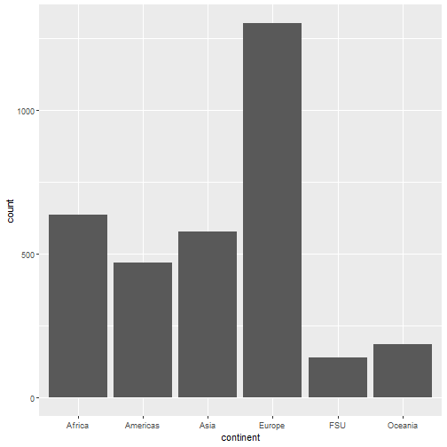
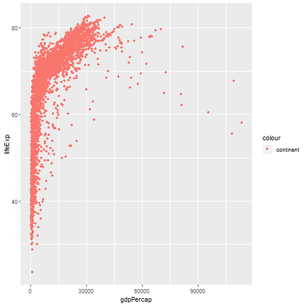
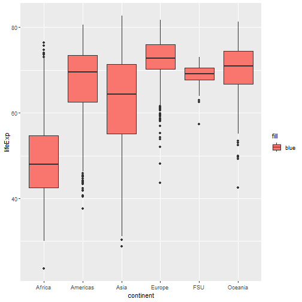
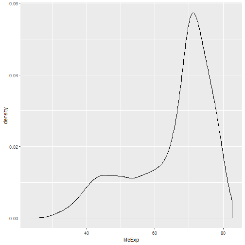
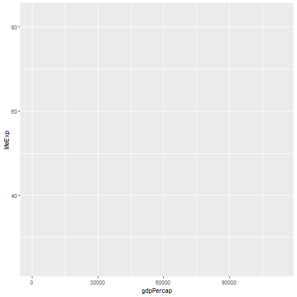
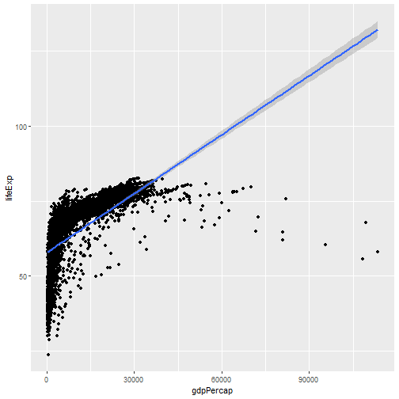

---
title       : Visualization with `ggplot2`
author      : Adam J Sullivan 
job         : Assistant Professor of Biostatistics
work        : Brown University
framework   : io2012        # {io2012, html5slides, shower, dzslides, ...}
highlighter : highlight.js # {highlight.js, prettify, highlight}
hitheme     :  github     # 
widgets     : [mathjax, quiz, bootstrap, interactive] # {mathjax, quiz, bootstrap}
ext_widgets : {rCharts: [libraries/nvd3, libraries/leaflet, libraries/dygraphs]}
mode        : selfcontained # {standalone, draft}
knit        : slidify::knit2slides
logo        : publichealthlogo.png
biglogo     : publichealthlogo.png
assets      : {assets: ../../assets}
---  .segue bg:grey


# `ggplot2`


--- .segue .quote bg:#C0C8CE


<q>  Appropriate graphical analysis may make the conclusions so clearcut that detailed specific analysis is unnecessary </q>

<q>-- David Cox (1978)</q>


--- .class #id

## `ggplot2`


- We will begin our journey into statistical graphics with the package `ggplot2`. 
- This is a package by Hadley Wickham and is part of the tidyverse. 
- It is a very comprehensive and easily adaptable language of graphics. 

--- .class #id

## What can't `ggplot2` do?


- A good place to start might be with what  `ggplot2` cannot do:
  - 3d graphs.
  - Interactive graphs, use `ggvis`
  - DAGs, see `igraph`
- We will now focus on all the things it can do.


--- .class #id


## `ggplot2` components


- `ggplot2` is built off the grammar of graphics with a very intuitive structure. 
- The base graphics built into R require the use of many different functions and each of them seem to have their own method for how to use them.   
- `ggplot2` will be more fluid and the more you learn about it the more amazing of graphics you can create. 

--- .class #id


## `ggplot2` components


- We will get started with the components of every `ggplot2` object:
  1. **data**
  2. **aesthetic mappings** between variables in the data and visual properties.
  3. At least one layer which describes how to render the data. 
    - Many of these are with the `geom_foo()` function. 


--- .class #id


## Our Data

- We will be working with data from [gapminder](https://www.gapminder.org/)
- We can access this by installing the package in R:
  

```r
install.packages("gapminder")
library(gapminder)
```


--- .class #id

## Gapminder Data


```
## # A tibble: 3,313 x 6
##    country     continent  year lifeExp      pop gdpPercap
##    <fct>       <fct>     <int>   <dbl>    <int>     <dbl>
##  1 Afghanistan Asia       1952    28.8  8425333      779.
##  2 Afghanistan Asia       1957    30.3  9240934      821.
##  3 Afghanistan Asia       1962    32.0 10267083      853.
##  4 Afghanistan Asia       1967    34.0 11537966      836.
##  5 Afghanistan Asia       1972    36.1 13079460      740.
##  6 Afghanistan Asia       1977    38.4 14880372      786.
##  7 Afghanistan Asia       1982    39.9 12881816      978.
##  8 Afghanistan Asia       1987    40.8 13867957      852.
##  9 Afghanistan Asia       1992    41.7 16317921      649.
## 10 Afghanistan Asia       1997    41.8 22227415      635.
## # ... with 3,303 more rows
```


--- .class #id

## Gapminder Data

- We can see the names of the variables by using the `names()` function:


```r
names(gapminder_unfiltered)
```

```
## [1] "country"   "continent" "year"      "lifeExp"   "pop"       "gdpPercap"
```


--- .class #id

## `ggplot()` Basics

- We will begin with a basic graph of appearances by alignment


```r
library(ggplot2)
ggplot(data=gapminder_unfiltered, aes(x=gdpPercap, y=lifeExp))
```


--- .class #id

## `ggplot()` Basics


--- .class #id

## `ggplot()` Statement

- We can see that all we have is the basic layout of axis. 
- The data and aes gives us the basic layout. 
- We need `geom_foo()` to make a proper graph. 


--- .class #id

## `geom_point()` Statement

- We can add`geom_point()` to this:


```r
ggplot(data=gapminder_unfiltered, aes(x=gdpPercap, y=lifeExp)) + 
  geom_point()
```


--- .class #id

## `geom_point()` Statement


--- .class #id

## Bar Graphs

- We could then consider simple bar graphs
- For example if we wanted to know how many observations per continent there were:
  

```r
ggplot(data=gapminder_unfiltered, aes(x=continent)) + 
  geom_bar()
```
- Note: With bar graphs we only need the x-axis. 

--- .class #id

## Bar Graphs


  



--- .class #id

## Basic Template

```
ggplot(data= <DATA>, aes(x=<X-VARIABLE>, y=<Y-VARIABLE>)) + 
    <GEOM_FUNCTION>()
```

---  .segue bg:grey


# Aesthetics


--- .class #id

## Aesthetics

- The basic aesthetics are mapping the data to the x and y axis. 
- We can also add:
  - `alpha`: makes points transparent to see overlaps better
  - `fill`: Fills objects with color 
  - `color`: Changes color of points or lines.
  - `shape`: Changes spape of points


--- .class #id


## Aesthetics:  `alpha`


```r
ggplot(data=gapminder_unfiltered, aes(x=gdpPercap, y=lifeExp)) + 
  geom_point(aes(alpha=1/100))
```

--- .class #id

## Aesthetics:  `alpha`


--- .class #id

## Aesthetics:  `alpha`

- It can be hard to see the transparency when they are so close.
- We can set the transparency to a variable


--- .class #id

## On Your Own: RStudio Practice #1

- Set `alpha=year`
- Set `alpha=pop`
- How does this change things?

--- .class #id

## Aesthetics:  `alpha`


--- .class #id

## Aesthetics:  `color`

- We can easily change the color of points and lines using `color`


```r
ggplot(data=gapminder_unfiltered, aes(x=gdpPercap, y=lifeExp)) + 
  geom_point(aes(color="continent"))
```


--- .class #id

## Aesthetics:  `color`




--- .class #id 

## On Your Own: RStudio Practice #2

- Set `color="blue"`
- How does this change things?


--- .class #id

## Aesthetics: `shapes`

- We can change the shape of points based on different variables.


```r
ggplot(data=gapminder_unfiltered, aes(x=gdpPercap, y=lifeExp)) + 
  geom_point(aes(shape="continent"))
```


--- .class #id

## Aesthetics: `shapes`


--- .class #id

## Your Turn

- Try using both shape and color. 
- How does this add dimensionality to the graph?


--- .class #id

## Aesthetics: `fill`

- We can fill objects with color as well


```r
ggplot(data=gapminder_unfiltered, aes(x=continent, y=lifeExp)) + 
  geom_boxplot(aes(fill="blue"))
```


--- .class #id

## Aesthetics: `fill`

- This doesnt have the same effect as `color`




--- .class #id

## Aesthetics: `fill`

- We can use other variables to add dimensionality


```r
ggplot(data=gapminder_unfiltered, aes(x=continent, y=lifeExp)) + 
  geom_boxplot(aes(fill=country))
```

- I didnt print this as there are so many countries the labels can be hard to deal with at this point. 


---  .segue bg:grey

# Geoms

--- .class #id

## Geoms

- There are many `geom_foo()` functions we can use. 
- The Cheatsheet on   `ggplot()` is a good place to start for more. 

--- .class #id

## Other Plots: Density


```r
ggplot(data=gapminder_unfiltered, aes(x=lifeExp)) + 
  geom_density()
```


--- .class #id

## Other Plots: Density





--- .class #id

## Other Plots: Histogram


--- .class #id

## On Your Own: RStudio Practice #3

- There is also a way to change binwidths on a histogram. 
- Try the code below and change the `binwidth`.


```r
ggplot(data=gapminder_unfiltered, aes(x=lifeExp)) + 
  geom_histogram(binwidth=1)
```


---  .segue bg:grey

#  More Layers

--- .class #id

## More Layers

- So far we have just had 2 layers to our graphs. 
- We can add many layers to plots. 


```r
ggplot(data=gapminder_unfiltered, aes(x=gdpPercap, y=lifeExp)) + 
  geom_point() + 
  geom_smooth(method="lm")
```
  
 
--- .class #id

## More Layers


 
--- .class #id


## On Your Own: RStudio Practice #4

- We can actually save plots.
- Then we can add layers to a named plot
- Run the code line by line below to see how this works





  
  
```

